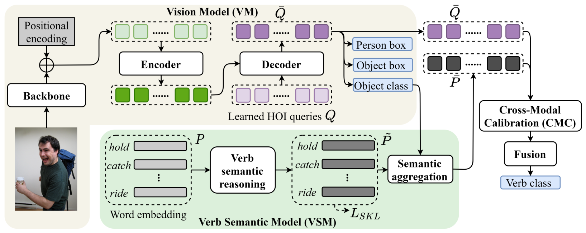

# [AAAI2022] Detecting Human-Object Interactions with Object-Guided Cross-Modal Calibrated Semantics 

<div align="center">
  
  <p>Overall pipeline of OCN.</p>
</div>
The source codes for AAAI2022 Paper: 
Detecting Human-Object Interactions with Object-Guided Cross-Modal Calibrated Semantics.  
[[arXiv]](https://github.com/JacobYuan7/OCN-HOI-Benchmark)
[[AAAI official paper]](https://github.com/JacobYuan7/OCN-HOI-Benchmark)


If you find our work or the codebase inspiring and useful to your research, please cite
```bibtex

```
## Dataset preparation
### 1. HICO-DET
HICO-DET dataset can be downloaded [here](https://drive.google.com/open?id=1QZcJmGVlF9f4h-XLWe9Gkmnmj2z1gSnk). After finishing downloading, unpack the tarball (`hico_20160224_det.tar.gz`) to the `data` directory.

Instead of using the original annotations files, we use the annotation files provided by the PPDM authors. The annotation files can be downloaded from [here](https://drive.google.com/open?id=1WI-gsNLS-t0Kh8TVki1wXqc3y2Ow1f2R). The downloaded annotation files have to be placed as follows.
```
qpic
 |─ data
 │   └─ hico_20160224_det
 |       |─ annotations
 |       |   |─ trainval_hico.json
 |       |   |─ test_hico.json
 |       |   └─ corre_hico.npy
 :       :
```

### 2. V-COCO
First clone the repository of V-COCO from [here](https://github.com/s-gupta/v-coco), and then follow the instruction to generate the file `instances_vcoco_all_2014.json`. Next, download the prior file `prior.pickle` from [here](https://drive.google.com/drive/folders/10uuzvMUCVVv95-xAZg5KS94QXm7QXZW4). Place the files and make directories as follows.
```
qpic
 |─ data
 │   └─ v-coco
 |       |─ data
 |       |   |─ instances_vcoco_all_2014.json
 |       |   :
 |       |─ prior.pickle
 |       |─ images
 |       |   |─ train2014
 |       |   |   |─ COCO_train2014_000000000009.jpg
 |       |   |   :
 |       |   └─ val2014
 |       |       |─ COCO_val2014_000000000042.jpg
 |       |       :
 |       |─ annotations
 :       :
```
For our implementation, the annotation file have to be converted to the HOIA format. The conversion can be conducted as follows.
```
PYTHONPATH=data/v-coco \
        python convert_vcoco_annotations.py \
        --load_path data/v-coco/data \
        --prior_path data/v-coco/prior.pickle \
        --save_path data/v-coco/annotations
```
Note that only Python2 can be used for this conversion because `vsrl_utils.py` in the v-coco repository shows a error with Python3.

V-COCO annotations with the HOIA format, `corre_vcoco.npy`, `test_vcoco.json`, and `trainval_vcoco.json` will be generated to `annotations` directory.

## Dependencies and Training
To simplify the steps, we combine the installation of externel dependencies and training into one '.sh' file. You can directly run the codes after rightly preparing the dataset.
```
# Training on HICO-DET
bash train_hico.sh
# Training on V-COCO
bash train_vcoco.sh
```
Note that you can refer to the publicly available [codebase](https://github.com/hitachi-rd-cv/qpic) for the preparation of two datasets.


## Pre-trained parameters
OCN uses COCO pretrained models for fair comparisons with previous methods. The pretrained models can be downloaded from [DETR](https://github.com/facebookresearch/detr) repository. 

For HICO-DET, you can convert the pre-trained parameters with the following command.
```
python convert_parameters.py \
        --load_path /PATH/TO/PRETRAIN \
        --save_path /PATH/TO/SAVE
```
For V-COCO, you can convert the pre-trained parameters with the following command.
```
python convert_parameters.py \
        --load_path /PATH/TO/PRETRAIN \
        --save_path /PATH/TO/SAVE \
        --dataset vcoco \
```


## Evaluation
The mAP on HICO-DET under the Full set, Rare set and Non-Rare Set will be reported during the training process. Or you can evaluate the performance using commands below:
```
python main.py \
    --pretrained /PATH/TO/PRETRAINED_MODEL \
    --output_dir /PATH/TO/OUTPUT \
    --hoi \
    --dataset_file hico \
    --hoi_path /PATH/TO/data/hico_20160224_det \
    --num_obj_classes 80 \
    --num_verb_classes 117 \
    --backbone resnet101 \
    --num_workers 4 \
    --batch_size 4 \
    --exponential_hyper 1 \
    --exponential_loss \
    --semantic_similar_coef 1 \
    --verb_loss_type focal \
    --semantic_similar \
    --OCN \
    --eval \
```

The results for the official evaluation of V-COCO must be obtained by the generated pickle file of detection results.
```
python generate_vcoco_official.py \
        --param_path /PATH/TO/CHECKPOINT \
        --save_path /PATH/TO/SAVE/vcoco.pickle \
        --hoi_path /PATH/TO/VCOCO/data/v-coco \
        --batch_size 4 \
        --OCN \
```
Then you should run following codes after modifying the path to get the final performance:
```
python datasets/vsrl_eval.py
```

## Results
Below we present the results and links for downloading corresponding parameters and logs:
(The checkpoints can produce higher results than what are reported in the paper.)
We will soon update this table.


